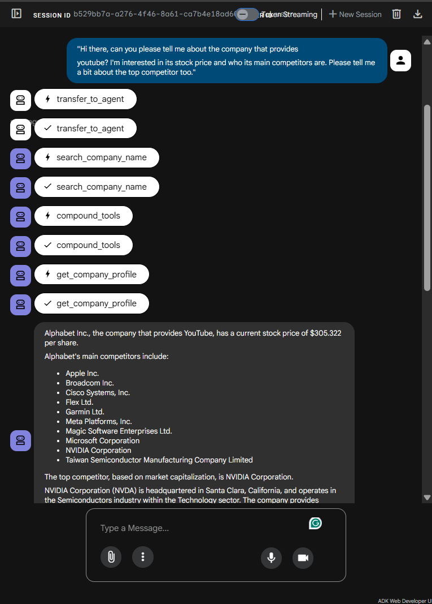
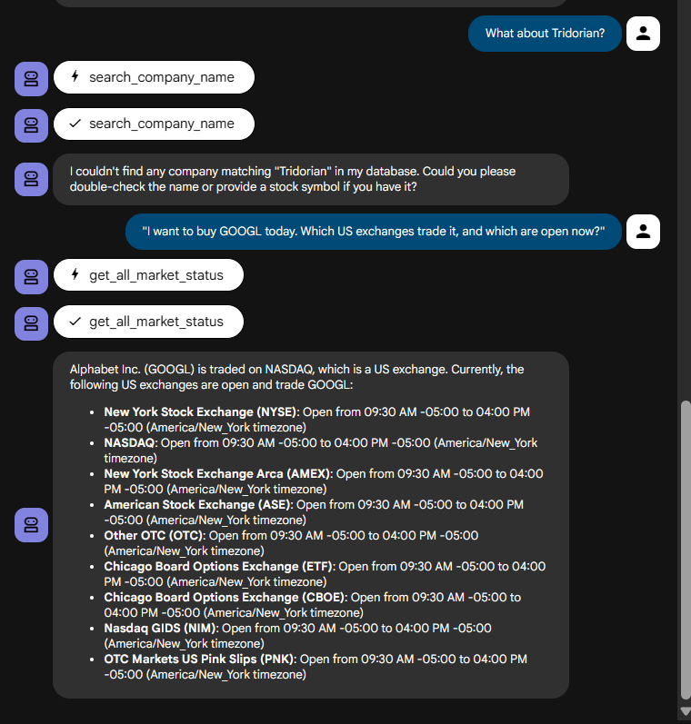

# Tridorian Take-Home Assignment

## Demo Link
You can view a live demo of the Tridorian agent at the following link: [http://103.126.117.196:8000](http://103.126.117.196:8000)

## Setup Instructions
1. **Clone this repository**

2. **Install `uv` globally:**
  ```bash
  pip install uv
  ```

3. **Create a virtual environment using uv:**
  ```
  uv venv
  ```

4. **Activate the virtual environment:**
  - On Windows:
    ```
    .venv\Scripts\activate
    ```
  - On macOS/Linux:
    ```
    source .venv/bin/activate
    ```

5. **Install dependencies:**
  ```
  uv pip install -e .
  ```

6. **Configure API keys:**
  - Copy the `env_example` file to `.env`:
    ```
    cp env_example .env
    ```
  - Edit `.env` and set the following keys:
    - `GOOGLE_API_KEY`: Your [Google Gemini API key.](https://aistudio.google.com/app/api-keys)
    - `FMP_API_KEY`: Your [Financial Modeling Prep API key.](https://site.financialmodelingprep.com/developer/docs/dashboard?tab=apiDetails)
  - Ensure `GOOGLE_GENAI_USE_VERTEXAI=0` is set.

## How to Run


1. **Start the web interface:**
   ```
   adk web --port 8000
   ```

2. **Access the agent:**
   - Open your browser and go to `http://localhost:8000`.
   - Interact with the agent through the web interface.

## Test Scenarios

#### Scenario 1: "Hi there, can you please tell me about the company that provides youtube? I'm interested in its stock price and who its main competitors are. Please tell me a bit about the top competitor too."

**Agent Actions:**

1. search_company_name(Alphabet) 
2. compound_tools
  a. get_real_time_stock_price(GOOGL)
  b. get_stock_peers(GOOGL)
3. get_company_profile(NVDA)  # for top competitor NVIDIA

**Agent Response:**

Alphabet Inc., the company that provides YouTube, has a current stock price of $305.322 per share.

Alphabet's main competitors include:
- Apple Inc.
- Broadcom Inc.
- Cisco Systems, Inc.
- Flex Ltd.
- Garmin Ltd.
- Meta Platforms, Inc.
- Magic Software Enterprises Ltd.
- Microsoft Corporation
- NVIDIA Corporation
- Taiwan Semiconductor Manufacturing Company Limited

The top competitor, based on market capitalization, is NVIDIA Corporation.

NVIDIA Corporation (NVDA) is headquartered in Santa Clara, California, and operates in the Semiconductors industry within the Technology sector. The company provides graphics, and compute and networking solutions globally. Its products, including GeForce GPUs for gaming and PCs, Quadro/NVIDIA RTX GPUs for enterprise workstations, and Data Center platforms for AI, are utilized across gaming, professional visualization, datacenter, and automotive markets. The CEO of NVIDIA Corporation is Jen-Hsun Huang, and the company was incorporated on January 22, 1999.

#### Scenario 2: "What about Tridorian?"

**Agent Actions:**

1. search_company_name(Tridorian) 

**Agent Response:**

I couldn't find any company matching "Tridorian" in my database. Could you please double-check the name or provide a stock symbol if you have it?

#### Scenario 3: "I want to buy GOOGL today. Which US exchanges trade it, and which are open now?"

**Agent Actions:**

1. get_all_market_status

**Agent Response:**

Alphabet Inc. (GOOGL) is traded on NASDAQ, which is a US exchange. Currently, the following US exchanges are open and trade GOOGL:

- New York Stock Exchange (NYSE): Open from 09:30 AM -05:00 to 04:00 PM -05:00 (America/New_York timezone)
- NASDAQ: Open from 09:30 AM -05:00 to 04:00 PM -05:00 (America/New_York timezone)
- New York Stock Exchange Arca (AMEX): Open from 09:30 AM -05:00 to 04:00 PM -05:00 (America/New_York timezone)
- American Stock Exchange (ASE): Open from 09:30 AM -05:00 to 04:00 PM -05:00 (America/New_York timezone)
- Other OTC (OTC): Open from 09:30 AM -05:00 to 04:00 PM -05:00 (America/New_York timezone)
- Chicago Board Options Exchange (ETF): Open from 09:30 AM -05:00 to 04:00 PM -05:00 (America/New_York timezone)
- Chicago Board Options Exchange (CBOE): Open from 09:30 AM -05:00 to 04:00 PM -05:00 (America/New_York timezone)
- Nasdaq GIDS (NIM): Open from 09:30 AM -05:00 to 04:00 PM -05:00 (America/New_York timezone)
- OTC Markets US Pink Slips (PNK): Open from 09:30 AM -05:00 to 04:00 PM -05:00 (America/New_York timezone)


## Design Choices

### Agent System Prompt Design

The root agent's system prompt is designed to handle conversational queries by instructing the agent to answer in plain, readable language, summarizing key points clearly, and avoiding raw data. For extracting tickers, the sub-agent (fmp_agent) uses tools that require explicit symbols, so the prompt encourages natural language processing to identify company names and map them to tickers using the search tool.

The fmp_agent's instruction is straightforward: "Use the available tools to fetch stock and market data." This allows the LLM to decide when to call tools based on the query.

### Multi-Agent Architecture

The multi-agent design provides modularity and scalability. Each sub-agent is responsible for a specific domain (e.g., fmp_agent handles financial data). This separation allows new functionalities to be added independently without modifying existing agent logic. New sub-agents can be created and merged into the root agent, keeping the codebase maintainable and extensible.


### Compound Tool Structure

- **analyze_stock_competitors**
The `analyze_stock_competitors` function demonstrates a parallel-then-sequential pattern:

  1. **Parallel Phase**: Uses `asyncio.gather()` to fetch real-time stock price and peer data concurrently:
    ```python
    real_time_stock_price_data, competitors_data = await asyncio.gather(
      get_real_time_stock_price(symbol), get_stock_peers(symbol)
    )
    ```

  2. **Sequential Phase**: Filters to top 3 peers, then launches parallel profile fetches:
    ```python
    peers = competitors_data[:3]
    profile_tasks = [(get_company_profile(peer["symbol"])) for peer in peers]
    competitor_profiles = await asyncio.gather(*profile_tasks)
    ```

- **with_compound_tools**
The `with_compound_tools` wrapper abstracts individual async functions into a single compound tool. It aggregates multiple tools into one callable that the LLM can invoke, reducing tool proliferation and improving context window efficiency. The wrapper maintains the async/await pattern, allowing the agent to orchestrate parallel execution of independent API calls while preserving sequential dependencies when needed.

## AI Tool Usage Log

- **Tools Used:** GitHub Copilot, ChatGPT
- **Contributions:**
  - **Documentation Writing:** Assisted in structuring and clarifying documentation since clear technical writing requires careful organization that I wanted to improve upon.
  - **Prompt Engineering:** Helped refine system prompts to be more understandable and effective for the AI agent's decision-making.
  - **Code Refactoring:** Used AI to identify and implement improvements like adding try-except blocks across all tools to ensure consistent error handling, reducing boilerplate code. Creating all TypeDicts from API responses examples.
  - **Reducing Repetitive Tasks:** Automated routine code patterns to minimize manual work and focus effort on critical logic and agent behavior.
- **Why:** To improve code quality and documentation clarity while freeing up time to concentrate on the agent's core functionality and design decisions.

**ChatGPT Chat History**: [Link to Chat History](https://chatgpt.com/share/69459da7-0e1c-8004-9d24-105dbebbcf1b)

## Assumptions & Trade-offs

### Assumptions
- Users have valid API keys for FMP and Gemini.
- The agent runs in a development environment with internet access for API calls.
- Company searches will return relevant results; no handling for ambiguous names beyond the top 5 results.

### Error Handling
- Tools return error dictionaries on exceptions, which the agent can report.
- For failing tools, the agent would inform the user and suggest alternatives, like manual searches.

## Assets

### Scenario 1


### Scenarios 2 & 3
